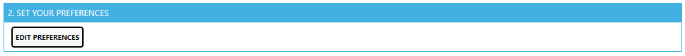
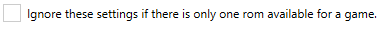

# RomSetManager
Manage all your retro-roms.

Readme under development...will get finished soon.

## What is it about:
If you have tons of roms lying around on your computer and these roms are named like
```
Adventures of Batman and Robin, The (U) [f1+2C].gen
Adventures of Batman and Robin, The (E) [!].gen
Adventures of Batman and Robin, The (U) [b2].gen
Adventures of Batman and Robin, The (U) [p1][!].gen
Altered Beast (UE) (REV02) [T+Por_Son_Car].gen
```

and you just don't know what all these chryptic names stands for

and you just want the best of these games filtered in an clean directory,

you probably need a tool like this ;)


## How to use it:

### 1. Download the latest version of this tool an extract it to any directory

link: TODO 2017/07/19

### 2. Start
```
RomSetManager.exe
```


### 3. Choose the directories


#### Source Rom Directory
Choose your Directory where all your roms are located. This directory has to have the same structure as retropie like


#### Output Rom Directory
Choose an empty directory where all the modified roms will saved to.

#### CLONE DIRECTORY-STRUCTURE FROM RETROPIE
if you have not this source-directory-structure you can copy it (just the folder) from your retropie by clicking this button.
After that you should copy your roms in the correct system-subdir.

### 4. Set your preferences

Here you can choose your preferences for finding the correct rom-files if you have multiple of the same game





