# RomSetManager
Manage all your retro-roms.

Readme under development...will get finished soon.

## What is it about:
If you have tons of roms lying around on your computer and these roms are named like
```
Adventures of Batman and Robin, The (U) [f1+2C].gen
Adventures of Batman and Robin, The (E) [!].gen
Adventures of Batman and Robin, The (U) [b2].gen
Adventures of Batman and Robin, The (U) [p1][!].gen
Altered Beast (UE) (REV02) [T+Por_Son_Car].gen
```

and you just don't know what all these chryptic names stands for

and you just want the best of these games filtered in an clean directory,

you probably need a tool like this ;)


## How to use it:

### 1. Download the latest version of this tool an extract it to any directory

link: TODO 2017/07/19

### 2. Start
```
RomSetManager.exe
```
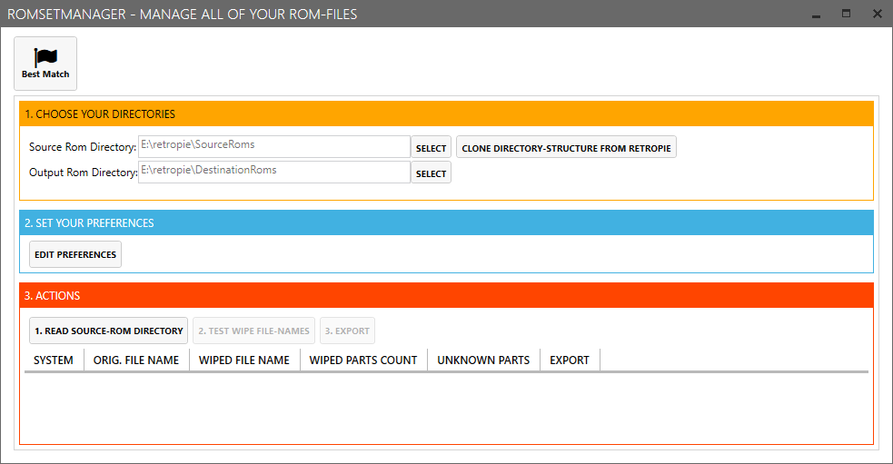

### 3. Choose the directories
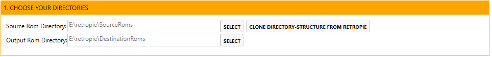

#### Source Rom Directory
Choose your Directory where all your roms are located. This directory has to have the same structure as retropie like
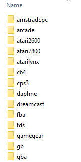

#### Output Rom Directory
Choose an empty directory where all the modified roms will saved to.

#### CLONE DIRECTORY-STRUCTURE FROM RETROPIE
if you have not this source-directory-structure you can copy it (just the folder) from your retropie by clicking this button.
After that you should copy your roms in the correct system-subdir.

### 4. Set your preferences
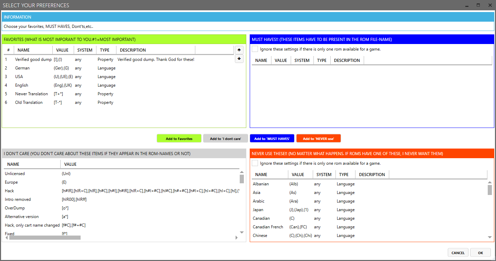

Here you can choose your preferences to find the correct rom-files if you have multiple of the same game

#### FAVORITE
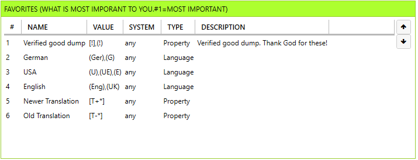

Add here your favorite items. If more than one rom-files of the same game is present in your folder it looks for the best match, starting from #1 (most important)

#### DONT CARE
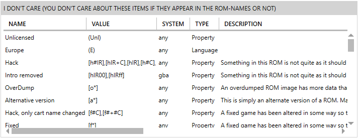

Add here your items you don't care about.

#### MUST HAVES
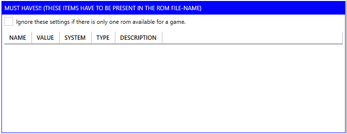

Add here your items your rom-name HAS TO HAVE. If these items doesn't appear in your rom-file-name the get ignored.

#### NEVER USE
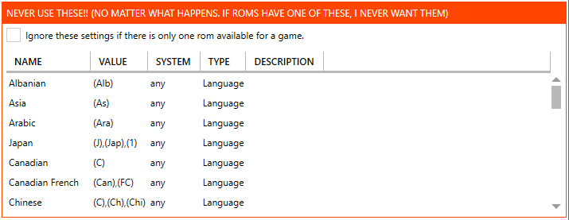

All roms with these items in their name will get ignored because you never want these.
In my case I only want english and german-roms because I'm not interessted in other langugages. So I simply add all these langauges here.

#### Ignore if only one rom-file of a game exist
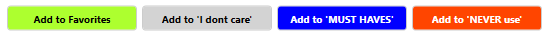

For the grids **NEVER USE** and **MUST HAVES** you can set this option. If only one rom-file of a game is available it will igore these settings.

### Moving items


you can simply move items from one grid to another by selecting the rows and click the button where these items should go to.

### 4. Read in your rom-directory
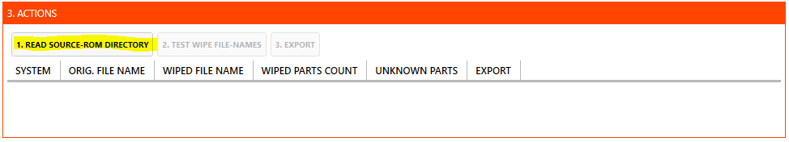

This will read all your rom-files from the defined source-rom-directory. If the files are compressed (7z,zip,rar,..) it will automatically read the files contained in this file.

### 5. Wipe rom-file-names
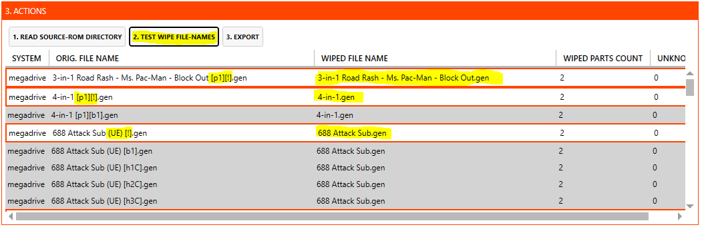

This will wipe all rom-files and uses your preferences to find the best match roms.

### 6. Export to destination-directory
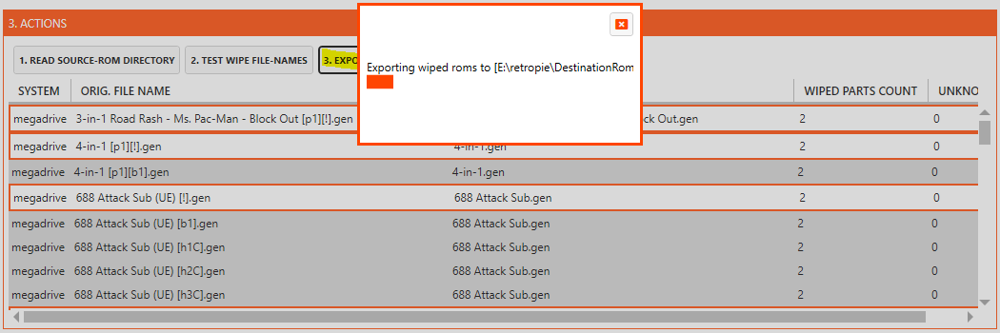

Exports all wiped rom-files to the destination-directory. It will always create a subdirectory for each system. If the system needs the rom-files compressed it will leave the file compressed.


## Configuration.xml
All of your settings are stored in the configuration.xml file.

